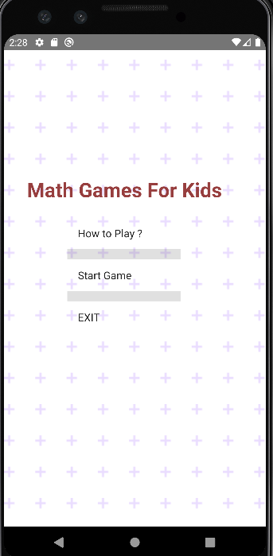
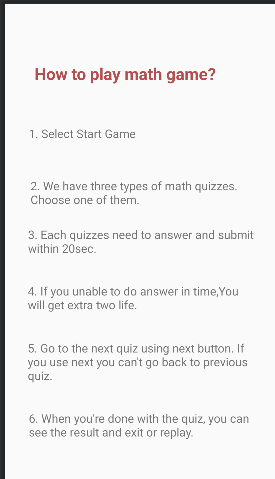
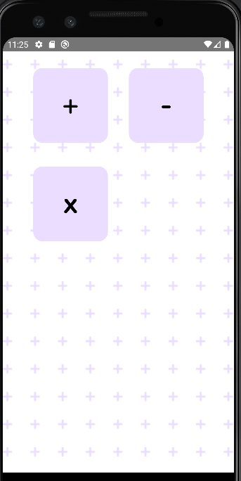
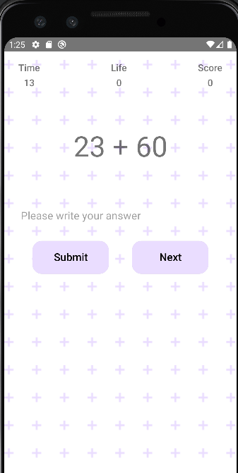
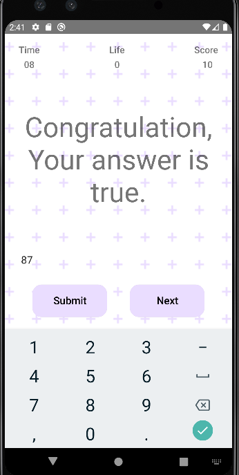
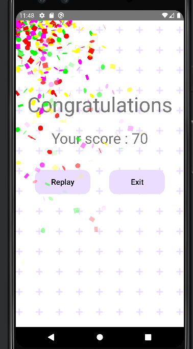

# Math Game App for kids
This math games app will help kids(6+) to learn addition, substruction, and multiplication. It is designed to let them think faster. It has two-way interaction with user. We are taking input from user and giving feedback on their input.

## List of used different components


```
ImageView
TextView
EditText
ImageButton
ListView
KonfettiView

```

## Preview






